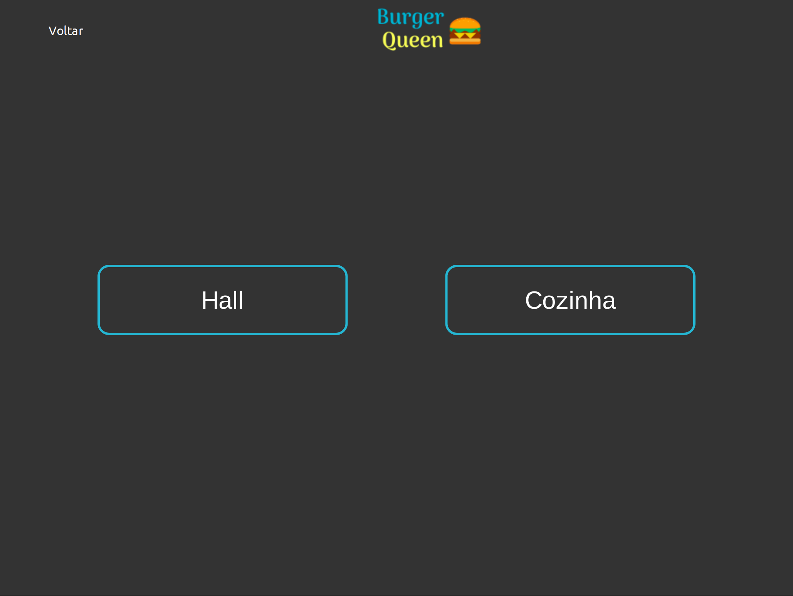
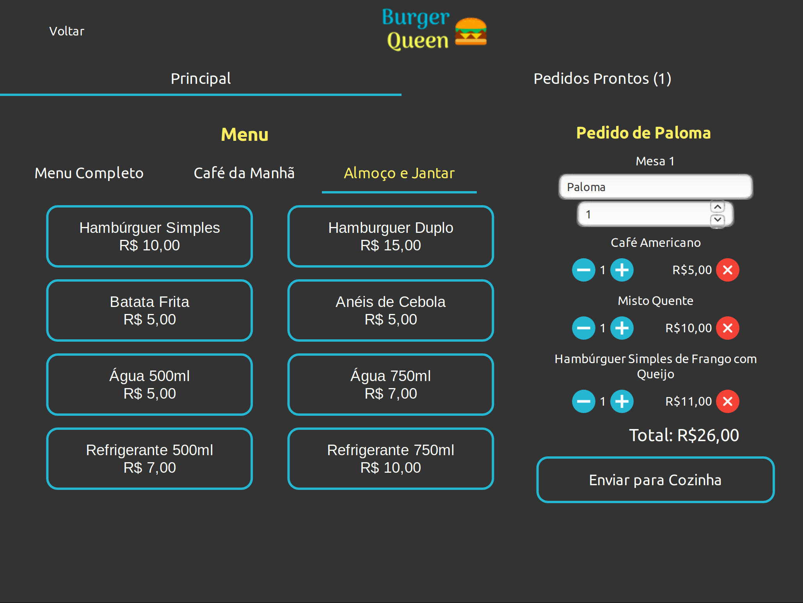
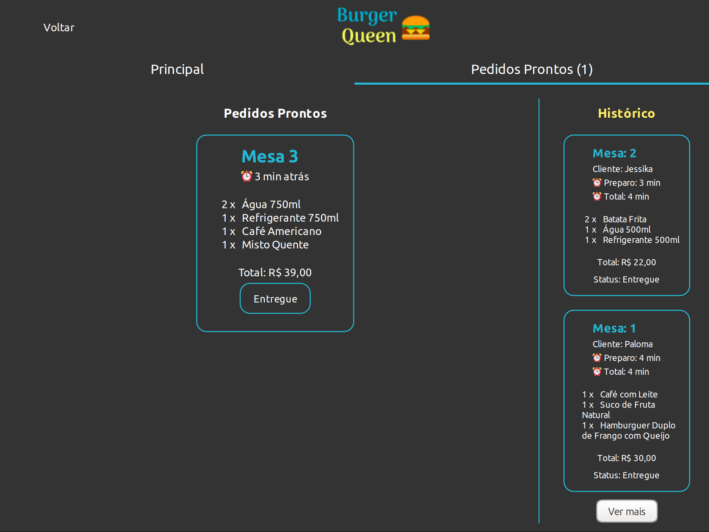
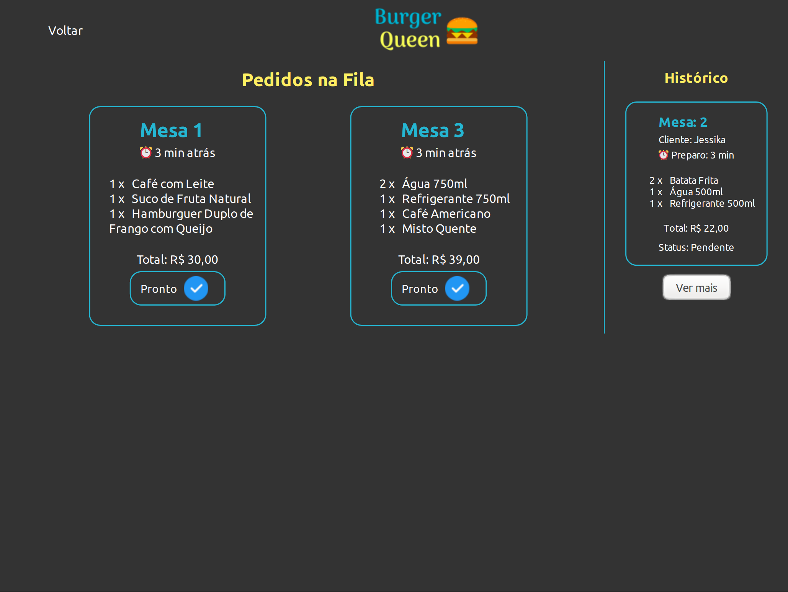

# Burger Queen

## Índice

* [1. Preâmbulo](#1-preâmbulo)
* [2. Resumo do projeto](#2-resumo-do-projeto)
* [3. Critérios de aceitação mínimos do projeto](#3-critérios-de-aceitação-mínimos-do-projeto)
* [4. Funcionamento da Aplicação](#4-funcionamento-da-aplicação)
* [7. Considerações Finais](#7-considerações-finais)

***

## 1. Preâmbulo
Projeto apresentado ao bootcamp da Laboratória, turma SAP-003.

## 2. Resumo do projeto
 O projeto consiste em uma aplicação para uma Hamburgueria/Restaurante para receber os pedidos, enviá-los para cozinha, marcar como prontos e como entregues.

 Para o desenvolvimento da aplicação, foram usadas seguintes tecnologias e ferramentas:

  * React Hooks
  * Firebase 
  * Framework [Aphrodite](https://github.com/Khan/aphrodite)
  * Biblioteca [growl-alert](https://github.com/vfreitas-/growl-alert)

## 3. Critérios mínimos de aceitação do projeto

### Definição do produto

O [_Product Owner_](https://www.youtube.com/watch?v=7lhnYbmovb4) nos apresentou
este _backlog_ que é o resultado do seu trabalho com o cliente até hoje.

***

#### [História de usuário 1] Garçom/Garçonete deve poder anotar o seu pedido

Eu como garçom/garçonete quero poder anotar o meu pedido saber o valor de cada 
produto e poder enviar o pedido para a cozinha para ser preparado.

##### Critérios de aceitação

O que deve acontecer para satisfazer as necessidades do usuário?

* Anotar o nome e mesa.
* Adicionar produtos aos pedidos.
* Excluir produtos.
* Ver resumo e o total da compra.
* Enviar o pedido para a cozinha (guardar em algum banco de dados).
* Funcionar bem e se adequar a um _tablet_.

***

#### [História de usuário 2] Chefe de cozinha deve ver os pedidos

Eu como chefe de cozinha quero ver os pedidos dos clientes em ordem, poder marcar que estão prontos e poder notificar os garçons/garçonetes que o pedido está pronto para ser entregue ao cliente.

##### Critérios de aceitação

* Ver os pedidos à medida em que são feitos.
* Marcar os pedidos que foram preparados e estão prontos para serem servidos.
* Ver o tempo que levou para preparar o pedido desde que chegou, até ser marcado como concluído.

***

#### [História de usuário 3] Garçom/Garçonete deve ver os pedidos prontos para servir

Eu como garçom/garçonete quero ver os pedidos que estão prontos para entregá-los rapidamente aos clientes.

##### Critérios de aceitação

* Ver a lista de pedidos prontos para servir.
* Marque os pedidos que foram entregues.

## 4. Funcionamento da Aplicação

### Pagina inicial

Na página inicial o usuário pode escolher qual interface quer acessar

### Interface Hall/Salão 

Na aba Principal da página Hall o garçon/garçonete pode ver o cardápio completo ou separado por tipo. Pode incluir os pedidos clicando sobre o nome do produto. 

Na caixa de pedidos, pode adicionar, subtrair ou deletar um item.

Na aba Pedidos Prontos, o usuário pode acompanhar os pedidos que chegam da cozinha e marcá-los como entregue.

É possivel, ainda, ver o histórico dos pedidos marcados como entregues, com o tempo que levou no preparo e o tempo até a entrega.

### Interface cozinha

Na página Cozinha, o usuário pode ter acessos aos pedidos à medida que são feitos, o número da mesa e há quanto tempo foi realizado.

Após selecionar o botão "Pronto", o pedido vai para o hitórico lateral onde tem o status de entrega adicionado ("Entregue" ou  "Pendente")

## 7. Considerações Finais
